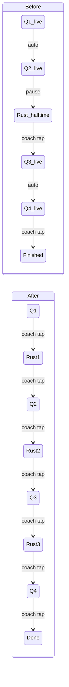
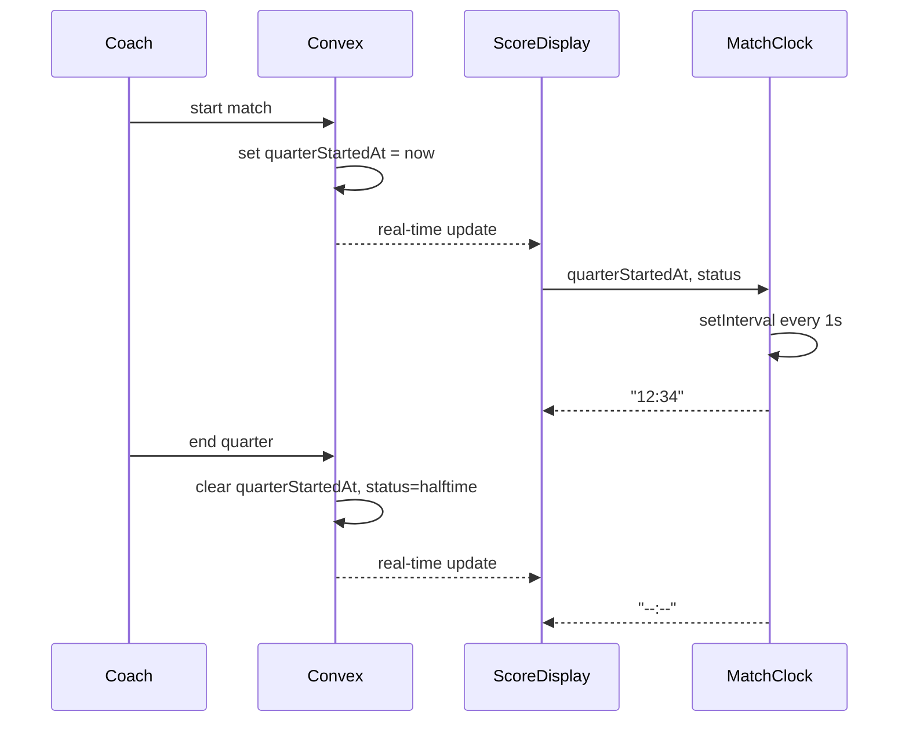

# Match Clock and Quarter Rest Periods

## Current State

- **No match clock** — the score display shows "LIVE" and "Kwart X" but no elapsed time.
- **Inconsistent breaks** — only Q2-to-Q3 has a rest state ("halftime"). Q1-to-Q2 and Q3-to-Q4 auto-advance immediately.
- **No `quarterStartedAt`** field — only `startedAt` (match start) exists in the schema.

## What Changes

### Part 1: Schema — add `quarterStartedAt`

**File:** [convex/schema.ts](convex/schema.ts)

Add `quarterStartedAt: v.optional(v.number())` to the `matches` table. This is the timestamp the current quarter began, used to calculate elapsed time client-side.

**Agent:** `convex-specialist` — schema migration, backwards-compatible addition.

### Part 2: Backend — generalize rest between ALL quarters

**File:** [convex/matchActions.ts](convex/matchActions.ts)

Currently the `nextQuarter` mutation (line ~182) only enters halftime when `quarterCount === 4 && nextQ === 3`. Change this to:

- **Any quarter end (except the final one)** sets `status: "halftime"` and clears `quarterStartedAt`. The current quarter is advanced to `nextQ`.
- **Final quarter end** sets `status: "finished"` as before.
- Remove the special-case `quarterCount === 4 && nextQ === 3` check.

The `resumeFromHalftime` mutation becomes the universal "start next quarter" action:

- Sets `status: "live"`, `quarterStartedAt: Date.now()`.
- Resets `lastSubbedInAt` for on-field players.
- Logs `quarter_start` event.

Also update the `start` mutation to set `quarterStartedAt: Date.now()` when starting the match.

**Agent:** `convex-specialist` — mutation logic, playing-time tracking correctness.

### Part 3: Backend — return `quarterStartedAt` to frontend

**File:** [convex/matches.ts](convex/matches.ts)

The `getForCoach` query already returns `...match` (all fields), so `quarterStartedAt` will be included automatically. Update the `getByPublicCode` query similarly if it doesn't already spread all fields.

**Agent:** `convex-specialist` — verify both queries return the new field.

### Part 4: Frontend types

**File:** [src/components/match/types.ts](src/components/match/types.ts)

Add `quarterStartedAt?: number` to the `Match` interface.

**Agent:** `frontend-designer` — quick type addition.

### Part 5: Frontend — Match Clock component

**New file:** `src/components/match/MatchClock.tsx`

A small component that:

- Receives `quarterStartedAt` and `status` as props.
- Uses `useState` + `setInterval(1000)` to tick every second.
- Displays elapsed time as `MM:SS` (e.g., "12:34").
- Only ticks when `status === "live"` and `quarterStartedAt` exists.
- Shows nothing (or "--:--") when not live.

**Agent:** `frontend-designer` — timer component with mobile-first styling.

### Part 6: Frontend — Wire clock into ScoreDisplay

**File:** [src/components/match/ScoreDisplay.tsx](src/components/match/ScoreDisplay.tsx)

Add the `MatchClock` next to the quarter label (e.g., "Kwart 1 — 12:34"). Pass `quarterStartedAt` and `status` as props. The clock sits directly below or beside the score.

**Agent:** `frontend-designer` — layout, mobile UX.

### Part 7: Frontend — Update MatchControls labels

**File:** [src/components/match/MatchControls.tsx](src/components/match/MatchControls.tsx)

Update `getNextQuarterLabel()` — since every quarter end now goes to rest, the button always says "Einde kwart X" (except the final one which says "Einde wedstrijd").

Update the halftime/rest resume button: instead of hardcoded "Start 2e helft", show dynamic text like "Start kwart {currentQuarter}" (since we're now in rest but `currentQuarter` has already advanced).

**Agent:** `frontend-designer` — Dutch label logic.

### Part 8: Frontend — Update ScoreDisplay quarter label

**File:** [src/components/match/ScoreDisplay.tsx](src/components/match/ScoreDisplay.tsx)

The `getQuarterLabel()` currently shows "Rust" only for halftime. Since all breaks now use status "halftime", this already works. Verify the label is correct for all transitions (e.g., rest between Q1 and Q2 should still show "Rust").

### Part 9: Tests

- Update `MatchControls.test.tsx` for new button labels.
- Write `MatchClock.test.tsx` — timer ticks, displays MM:SS, stops when not live.
- Verify `PlayingTimePanel.test.tsx` still passes (spread fix from earlier).

**Agent:** `test-agent` — write and verify all tests.

### Part 10: Build verification and code review

- Run `npm run build` to verify no TypeScript errors.
- Run full test suite.

**Agent:** `code-reviewer` — review all changes for security, 300 LOC, Dutch text, touch targets.

## State Machine (before vs. after)

## Future Items (document in HANDOFF.md, do NOT implement now)

- **Quarter time warning** — When elapsed time exceeds the expected quarter duration (e.g., 15 min), show a visual/audio warning to the coach. Not a hard stop, just a nudge. Useful when the coach loses track of time pitch-side.
- **Pause/stop clock during quarter** — Allow the coach (and later the referee/"scheidsrechter" role) to pause the match clock mid-quarter for injuries, stoppages, etc. The clock would freeze and resume when the coach taps again. Requires adding `pausedAt` / `accumulatedPauseTime` fields to the match schema.
- **Referee role** — A dedicated "scheidsrechter" role (separate from coach) who controls the official match clock and can stop/start time. The coach tracks lineup/subs, the referee tracks time authoritatively.

## Data Flow for Clock

