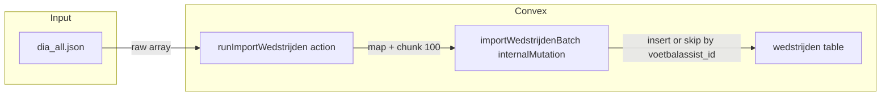

# Plan: Wedstrijden import in Convex

## Doel

- Nieuwe tabel **`wedstrijden`** voor kalender/uitslagen uit VoetbalAssist (aparte bron naast live `matches`).
- Import van 1373 records uit `dia_all.json`: **alleen inserts**, nooit bestaande records overschrijven (dedupe op `voetbalassist_id`).
- Convex-specialist patterns: indexgebruik, geen full table scan, beveiligde import (ops/admin).

## Architectuur

## 1. Schema uitbreiden

**Bestand:** [convex/schema.ts](convex/schema.ts)

Nieuwe tabel toevoegen vóór de sluitende `});` van `defineSchema`:

- **Velden:**  
  `voetbalassist_id`, `datum`, `tijd`, `datum_ms`, `thuisteam`, `uitteam`, `thuis_goals`, `uit_goals` (optional), `status`, `type`, `categorie`, `leeftijd`, `dia_team`, `veld`, `scheidsrechter`, `thuisteamLogo`, `uitteamLogo` (optional).
- **Indexen:**  
  `by_voetbalassist_id` (unieke lookup), `by_datum`, `by_team` (voor latere queries).

Alle velden verplicht behalve `thuis_goals`, `uit_goals`, `thuisteamLogo`, `uitteamLogo`. Strings voor datum/tijd; numbers voor `voetbalassist_id`, `datum_ms`, `leeftijd`.

## 2. Mapper (raw JSON → Convex-doc)

**Bestand:** nieuw bestand [convex/import/wedstrijdenMapper.ts](convex/import/wedstrijdenMapper.ts) (~100 LOC)

- **Input:** één raw object uit `dia_all.json` (o.a. `id`, `datum`, `uitslag`, `statusAfgelast`, `typeBeker`, `typeVriendschappelijk`, `thuisClubEnTeamNaamFriendly`, `uitClubEnTeamNaamFriendly`, `categorie`, `leeftijd`, `team`, `verkrijgVeldtekst`, `scheidsrechter`, `thuisteamLogo`, `uitteamLogo`).
- **Logica:**
  - `voetbalassist_id` = `id`.
  - `datum` = eerste 10 tekens van `datum` (YYYY-MM-DD).
  - `tijd` = deel na "T" in `datum` (HH:MM of leeg).
  - `datum_ms` = `new Date(datum).getTime()`.
  - `thuisteam` / `uitteam` = friendly namen; lege string toestaan.
  - **Uitslag:** HTML strippen uit `uitslag`; als patroon "X - Y" (cijfers): `thuis_goals` en `uit_goals` zetten; anders beide `undefined`.
  - **Status:** `statusAfgelast === true` → `"afgelast"`; anders als uitslag niet "-" en niet leeg → `"gespeeld"`; anders `"gepland"`.
  - **Type:** `typeBeker` → `"beker"`, `typeVriendschappelijk` → `"vriendschappelijk"`, anders `"competitie"`.
  - Overige velden 1-op-1; lege strings toestaan waar van toepassing.
- **Output:** object dat voldoet aan het Convex-schema (geschikt voor `insert("wedstrijden", ...)`).

Geen I/O; pure functie, eenvoudig unit-testbaar.

## 3. Import: internal mutation + action

**Bestand:** nieuw bestand [convex/import/importWedstrijden.ts](convex/import/importWedstrijden.ts)

**3a. Internal mutation `importWedstrijdenBatch`**

- **Args:** `wedstrijden: v.array(v.object({ ... }))` met exact de velden van het schema (validator op basis van schema).
- **Handler:** voor elk item: `ctx.db.query("wedstrijden").withIndex("by_voetbalassist_id", q => q.eq("voetbalassist_id", item.voetbalassist_id)).unique()`. Als resultaat **bestaat**: skippen (geen patch). Anders `ctx.db.insert("wedstrijden", { ...item })`. Geen auth in de internal mutation.
- **Return:** `{ created: number, skipped: number }`.

**3b. Action `runImportWedstrijden`**

- **Args:** `opsSecret: v.optional(v.string())`, `rawWedstrijden: v.array(v.any())` (raw VoetbalAssist-objecten).
- **Handler:**  
  - Eerst `hasValidOpsSecret(args.opsSecret)` (import uit [convex/lib/opsAuth.ts](convex/lib/opsAuth.ts)); zo niet, throw (geen Clerk in actions, dus alleen ops).
  - Map alle `rawWedstrijden` met de mapper uit stap 2; filter eventuele null/ongeldige items.
  - Chunks van 100; voor elke chunk `ctx.runMutation(internal.import.importWedstrijden.importWedstrijdenBatch, { wedstrijden: chunk })`.
  - Aggregeer `created` en `skipped`; return `{ totalCreated, totalSkipped, batchCount }`.

Gebruik van `v.any()` voor raw array is hier bewust (externe bron); mapper valideert de vorm. Eventueel later vervangen door een expliciete raw-validator.

## 4. Optioneel runscript

**Bestand:** [scripts/importWedstrijden.mjs](scripts/importWedstrijden.mjs) (of .mts)

- Leest `dia_all.json` van pad uit eerste CLI-argument of env (bijv. `WEDSTRIJDEN_JSON`).
- Laadt de JSON; roept de Convex-action aan met de raw array. Aanroep via `npx convex run import/importWedstrijden:runImportWedstrijden` met payload uit bestand (bijv. temp file op Windows om quoting te vermijden), of via Convex HTTP/client als beschikbaar.
- Vereist: `CONVEX_OPS_SECRET` (of andere afgesproken secret) voor de aanroep.

Als runscript te complex wordt door CLI/quoting, volstaat documentatie: "Import: voer action eenmalig uit met `npx convex run import/importWedstrijden:runImportWedstrijden` en payload uit een lokaal JSON-bestand (bijv. dia_all.json) of via Dashboard."

## 5. Queries (later / optioneel)

Geen wijzigingen in bestaande `matches`-queries. Eventueel later in [convex/matches.ts](convex/matches.ts) of nieuw bestand een query toevoegen, bijv. `listWedstrijdenByTeam` of `listWedstrijdenByDatum`, uitsluitend via indexen `by_team` en `by_datum`. Geen onderdeel van dit plan.

## 6. Bestandsgrootte en conventies

- [convex/schema.ts](convex/schema.ts): tabel + 3 indexen toevoegen houdt het bestand onder ~300 LOC (huidige ~205 + ~35).
- [convex/import/wedstrijdenMapper.ts](convex/import/wedstrijdenMapper.ts): alleen mappinglogica, compact.
- [convex/import/importWedstrijden.ts](convex/import/importWedstrijden.ts): validator-args, internal mutation, action; bij groei eventueel validator in apart bestand.

## 7. Verificatie

- Na implementatie: `npx convex dev`; daarna action aanroepen met een kleine subset uit `dia_all.json` (bijv. 5 items); controleren in Dashboard dat alleen nieuwe `voetbalassist_id`’s worden toegevoegd en tweede run dezelfde batch 100% skipped.
- Geen wijzigingen aan bestaande `matches`- of coach-/PIN-flow.

## Samenvatting taken

| # | Taak |
|---|------|
| 1 | Schema: tabel `wedstrijden` + indexen in `schema.ts` |
| 2 | Mapper: `wedstrijdenMapper.ts` met parse-logica (datum, uitslag, status, type) |
| 3 | Internal mutation `importWedstrijdenBatch` (insert-or-skip op `voetbalassist_id`) |
| 4 | Action `runImportWedstrijden` (opsSecret, map + chunk, aanroep internal mutation) |
| 5 | Optioneel: script om `dia_all.json` te lezen en action aan te roepen |
