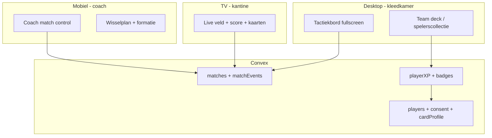
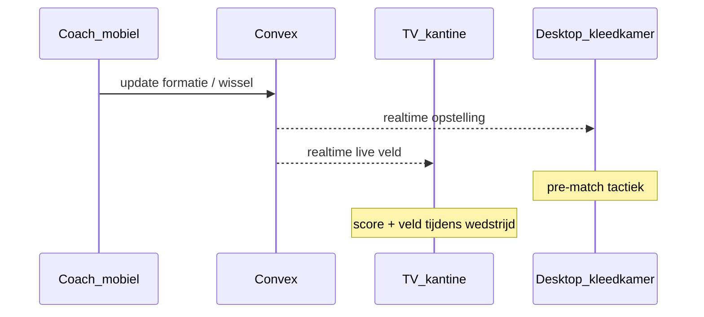
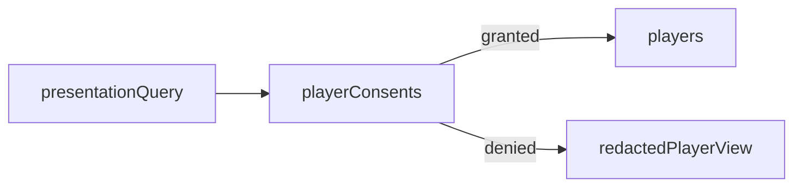
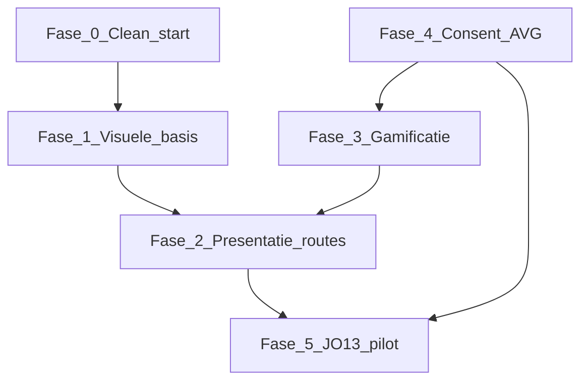

# DIA Live — Clean Start + JO13 Presentatie & Gamificatie (Fable)

**Doelgroep:** Fable (terminal-implementatie)  
**Voortgang bijhouden:** [fable-jo13-progress.md](./fable-jo13-progress.md) — **update dit bestand na elke werksessie**  
**Status:** Plan op basis van [HANDOFF.md](../../HANDOFF.md), [product-backlog.md](./product-backlog.md), en productbeslissingen 7 jul 2026.

**Pilotteams:** `jo13-1` (JO13-1) en `jo13-2` (JO13-2) — selectieteams met ouder/speler-toestemming vóór foto's en gamificatie.

---

## 1. Waar we nu staan

### Wat al werkt (hergebruiken, niet opnieuw bouwen)

| Gebied | Status | Belangrijkste bestanden |
|--------|--------|------------------------|
| Realtime wedstrijd-backend | Productie-klaar | `convex/matches.ts`, `convex/matchEvents.ts` |
| Auth (Clerk + userAccess) | Klaar | `convex/lib/userAccess.ts` |
| Admin desktop (~1600px) | Basis klaar | `src/components/admin/AdminWorkspace.tsx` |
| Formaties + plat veld | Grotendeels klaar | `src/lib/formations/`, `src/components/match/PitchView.tsx` |
| FC-achtige spelerskaarten | Visueel aanwezig | `src/components/match/FieldPlayerCard.tsx` (EA FC-stijl, silhouet) |
| Custom formaties | Schema + API | `convex/formationTemplates.ts`, `convex/schema.ts` |
| Wisselplan vooraf | Schema + API | `convex/substitutionPlans.ts` |
| Team-/clublogo's | Klaar | `src/components/TeamLogo.tsx`, `convex/lib/matchLogoFields.ts` |

### Wat nog ontbreekt t.o.v. jouw nieuwe richting

- **Geen** desktop/TV-presentatiemodus (kleedkamer + kantine)
- **Geen** gamificatie-laag (XP, levels, deck/collectie)
- **Geen** consent/AVG-model voor minderjarigen
- **Geen** `photoUrl` op spelers; kaarten tonen nog silhouet
- **Geen** team-vlag "selectieteam" — alle teams worden gelijk behandeld
- **Clean start** technisch deels gepland (Sportlink + verse Convex) maar niet gekoppeld aan dit producttraject

### Documentatie die Fable eerst moet lezen

1. [HANDOFF.md](HANDOFF.md) — architectuur, data-model, importregels
2. [docs/plans/product-backlog.md](docs/plans/product-backlog.md) — backlog §5 (foto's, live veld, plat bovenaanzicht)
3. [.cursor/handoff-positions-field-view.md](.cursor/handoff-positions-field-view.md) — formaties/veld
4. Sportlink masterplan (user `.cursor/plans/sportlink_verse_convex_4ee20e3e.plan.md`) — clean-start infrastructuur

---

## 2. Productvisie (clean start)

DIA Live blijft de **realtime wedstrijd-app** voor coaches (mobiel, pitch-side). De **nieuwe focus** voor de pilot:



**Kernprincipes:**
- Gamificatie en foto's **alleen** voor teams met `isSelectionTeam: true` én actieve consent
- Publieke TV-weergave toont **geen** persoonsgegevens zonder consent (initialen/rugnummer fallback)
- Coach mobiel blijft primair; presentatie is **read-mostly** met optionele coach-sync

---

## 3. Fasen

### Fase 0 — Platform clean start (1–2 weken)

**Doel:** Schone data-laag zodat de JO13-pilot niet op import-rommel bouwt.

| Stap | Actie | Referentie |
|------|-------|------------|
| 0.1 | Snapshot oude Convex-deployment + export JO12/JO13 historie | `scripts/archive/season-export/` |
| 0.2 | Seizoensarchief: `seasonKey` op matches; oude seizoen verborgen in standaard UI | HANDOFF speelweek-model |
| 0.3 | Sportlink als bond-bron (`sportlinkWedstrijdcode` sleutel) | sportlink_verse_convex plan |
| 0.4 | Ghost-duplicates opruimen; `active: false` voor gastspelers | HANDOFF bank-roster issue |
| 0.5 | Schema-bridge cleanup (`coachPin` legacy) na data-verify | product-backlog §4 |

**Acceptatie:** Admin/coach zien alleen actief seizoen; import is idempotent; geen dubbele wedstrijden bij datumwijziging.

---

### Fase 1 — Presentatie-fundament (2–3 weken)

**Doel:** Visuele basis voor desktop/TV vóór gamificatie.

#### 1a. Spelerskaarten upgraden (visueel, nog zonder XP)

- Breid `players` uit: `photoUrl?`, `photoStorageId?` (Convex storage)
- Admin upload-flow in `PlayersTab` (alleen admin + consent-check in fase 3)
- `FieldPlayerCard` + nieuwe `PlayerCardProfile` component: foto of initialen, rugnummer, positie, teamkleur
- Kaartgroottes voor presentatie: `useCardSize` uitbreiden met `presentation` breakpoint (TV: ~140px kaarten)

#### 1b. Plat tactiekbord (design-afstemming)

- HANDOFF eist **plat bovenaanzicht** — bevestig dat `PitchView` geen `perspective`/`rotateX` meer heeft (lineups-plan: grotendeels gedaan)
- Nieuwe `PresentationPitchView`: grotere slots, dikkere formatielijnen, leesbaar op 1920×1080 en 4K

#### 1c. Live veld op publieke route (basis voor TV)

- Uitbreiden [`src/app/live/[code]/page.tsx`](src/app/live/[code]/page.tsx) met optionele veldweergave wanneer `showLineup` en status `live|halftime`
- Hergebruik `PitchView` in read-only modus (`canEdit={false}`)

**Bestanden (indicatief):**
- `convex/schema.ts` — player photo velden
- `convex/playerPhotos.ts` — upload mutaties (nieuw, &lt;300 LOC)
- `src/components/presentation/PresentationPitchView.tsx` (nieuw)
- `src/components/match/FieldPlayerCard.tsx` — foto-ondersteuning

---

### Fase 2 — Desktop & TV presentatiemodi (2–3 weken)

**Doel:** Twee layouts zoals gekozen — kleedkamer (vooraf tactiek) + kantine (live).

#### Route-structuur (voorstel)

| Route | Doel | Device |
|-------|------|--------|
| `/present/team/[slug]` | Tactiekbord + teamdeck + formatie-kiezer | Desktop / tablet landscape |
| `/present/team/[slug]/live` | Fullscreen live: score, klok, veld, kaarten | TV / beamer (kantine) |
| `/present/match/[code]` | Alternatief: direct via wedstrijdcode (TV zonder team-login) | TV |

#### Kleedkamer-modus (`/present/team/[slug]`)

- Fullscreen, geen Clerk-nav; optioneel **presentatie-PIN** of coach-ingelogd
- Tabs: **Opstelling** | **Wisselplan** | **Teamdeck** (gamificatie, fase 3)
- Formatie-selector + `PresentationPitchView` + bank als kaartenrij
- Spiegelt coach-data realtime (Convex `useQuery`)

#### Kantine-modus (`/present/team/[slug]/live` of `/present/match/[code]`)

- Donkere achtergrond, grote score, wedstrijdklok
- Live veld met spelerskaarten (consent-aware: foto alleen met toestemming)
- Auto-refresh via Convex subscription (geen handmatige refresh)
- **TV-safe:** geen kleine touch-targets; min 48px; hoog contrast (zonlicht-kantine)

#### Technische eisen

- `prefers-reduced-motion` respecteren
- `?kiosk=1` query voor fullscreen-hint (optioneel screensaver uit)
- Responsive: 1280×720 minimum (club-TVs)



**Bestanden (nieuw):**
- `src/app/present/team/[slug]/page.tsx`
- `src/app/present/team/[slug]/live/page.tsx`
- `src/components/presentation/PresentationShell.tsx`
- `src/components/presentation/LivePresentationBoard.tsx`
- `convex/presentationQueries.ts` — publieke/read queries met privacy-filter

---

### Fase 3 — Gamificatie: XP, levels, team deck (3–4 weken)

**Doel:** Volledige spelervaring voor selectieteams — **alleen** met consent.

#### Datamodel (nieuw)

```typescript
// teams — uitbreiding
isSelectionTeam: v.optional(v.boolean())  // true voor jo13-1, jo13-2

// players — uitbreiding
cardProfile: v.optional(v.object({
  xp: v.number(),
  level: v.number(),
  rarity: v.union(v.literal("common"), v.literal("rare"), v.literal("epic")),
  seasonStats: v.object({ matches, minutes, goals, assists, cleanSheets }),
}))

// playerConsents — nieuwe tabel
playerId, teamId,
consentType: "photo" | "gamification" | "public_display",
status: "pending" | "granted" | "revoked",
grantedBy: "parent" | "player",
grantedAt, revokedAt,
parentEmail?, documentVersion
```

#### Game mechanics (pilot-scope)

| Mechanic | Bron | Regel |
|----------|------|-------|
| XP per wedstrijd | `matchPlayers.minutesPlayed` | bijv. 10 XP per gespeelde 15 min |
| XP doelpunt/assist | `matchEvents` | +25 goal, +15 assist |
| Level | cumulatief XP | level 1–20, drempels in config |
| Badges | events + milestones | "10 wedstrijden", "eerste doelpunt", fair play |
| Team deck | alle spelers team | collectie-grid in presentatiemodus |
| Rarity | level + badges | cosmetisch op kaart (gouden rand) |

**Belangrijk:** XP wordt **server-side** berekend (Convex cron of post-match mutation), nooit door client.

#### UI

- `PlayerCardGamified.tsx` — FC-kaart met level-balk, XP, badge-icons, rarity frame
- `TeamDeckGrid.tsx` — sorteer op level, positie, minuten
- Animaties: level-up overlay (alleen desktop/TV, niet coach mobiel tijdens wedstrijd)

**Bestanden (nieuw):**
- `convex/gamification.ts` — XP engine, badge toekenning
- `convex/playerConsents.ts` — consent CRUD + checks
- `src/lib/gamification/levels.ts` — drempels (pure config)
- `src/components/cards/PlayerCardGamified.tsx`

---

### Fase 4 — Consent & AVG (parallel met fase 3, verplicht vóór pilot-live)

**Doel:** Juridisch en ethisch verantwoord voor JO13 (minderjarigen).

#### Workflow

1. Admin markeert team als `isSelectionTeam` + start consent-ronde
2. Ouder ontvangt link (club/TC stuurt mail — zie HANDOFF: geen auto-mail uit app) naar `/consent/[token]`
3. Formulier (Nederlands): foto, gamificatie, publieke weergave — per optie ja/nee
4. Bij **geen** foto-consent: silhouet/initialen overal
5. Bij **geen** gamification-consent: kaart zonder XP/level (basis wedstrijdkaart)
6. Bij **geen** public_display: TV toont rugnummer + positie, geen naam/foto
7. Consent is **herroepbaar**; revoke wist `photoUrl` uit publieke queries (storage behouden voor admin audit)

#### Technisch

- Token-based publieke pagina (geen Clerk voor ouders)
- `assertPlayerConsent(ctx, playerId, type)` in elke query/mutation die foto/XP/naam lekt
- `docs/plans/avg-jo13-consent.md` — tekst voor ouders (dutch-ux-writer review)

**Acceptatie:** Geen enkele publieke/presentatie-query retourneert foto of XP zonder `granted` consent.

---

### Fase 5 — JO13-1 / JO13-2 pilot (1–2 weken)

| Stap | Actie |
|------|-------|
| 5.1 | Zet `isSelectionTeam: true` op `jo13-1` en `jo13-2` |
| 5.2 | Importeer/actieve roster via Sportlink; admin controleert `active` vlag |
| 5.3 | Start consent-ronde; minimaal 80% granted vóór foto's op TV |
| 5.4 | Coach training: kleedkamer-desktop + mobiel |
| 5.5 | Eerste wedstrijd: TV in kantine op `/present/team/jo13-1/live` |
| 5.6 | Retrospectief: XP/badge feedback van spelers/ouders |

**Niet in pilot:** andere teams, voice agent ([AGENT-ARCHITECTURE.md](AGENT-ARCHITECTURE.md)), volledige admin-UX-polish (wel niet-blokkerend).

---

## 4. Architectuur — privacy-laag



Alle presentatie-queries gaan via `convex/lib/privacyFilter.ts`:
- `redactPlayerForPublic(player, consents)` → veilige subset
- Hergebruik patroon uit [docs/actors-and-access.md](docs/actors-and-access.md)

---

## 5. Prioriteit & afhankelijkheden



**Kritiek pad:** F0 → F1 → F4 (consent vóór foto's/XP) → F3 → F2 → F5

---

## 6. Voortgang bijhouden

Werk **niet** in dit bestand afvinken — gebruik de live tracker:

**[fable-jo13-progress.md](./fable-jo13-progress.md)**

Daarin staan per-fase taken, blokkers en een werklog. Verwijzing ook in [HANDOFF.md](../../HANDOFF.md) § JO13-pilot.

---

## 7. Bewust buiten scope (pilot)

- Gamificatie voor niet-selectieteams
- App-store / native TV apps (web op browser-TV is voldoende)
- Automatische ouder-mails (club regelt communicatie)
- Volledige pre-match kwart-planning (substitutionPlans bestaat al; uitbreiding later)
- Sportlink standen-UI (al gepland apart)

---

## 8. Verificatie-checklist (Fable)

- [ ] `jo13-1` / `jo13-2` tonen presentatiemodus; andere teams niet
- [ ] Speler zonder consent: geen foto/naam op TV
- [ ] XP stijgt na wedstrijd; level-up zichtbaar op deck
- [ ] Kleedkamer en kantine-layouts werken op 1920×1080
- [ ] Coach mobiel wijziging → TV update binnen 1s (Convex realtime)
- [ ] `npm run build` + `npx vitest run` groen
- [ ] Geen bestand &gt;300 LOC (split indien nodig)
